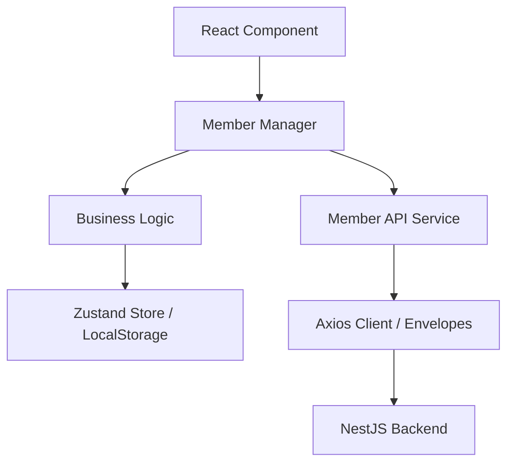

# Advanced API & Business Logic Architecture Plan

The goal is to align the frontend communication with the backend's "Envelope" pattern and implement a structured layer for business logic and local data persistence.

## User Review Required

> [!IMPORTANT]
> - I will implement the **BaseRequest** and **ApiResponse** types to match your NestJS backend exactly (including the `header` requirement).
> - For local persistence and business logic management, I recommend **Zustand**. It is the current industry favourite for its performance and simplicity in large-scale React projects.
> - I will introduce a **Repository/Manager Pattern** where business logic is separated from the UI, allowing for easy data persistence to `localStorage` or application state.

## Proposed Changes

### [Types] Standardized Envelopes

#### [NEW] [api.types.ts](file:///d:/SothyProject/NestJs/sansam_pdoud/Phdaot/src/api/types/api.types.ts)
- Define `RequestHeader` (platform, version, etc.).
- Define `BaseRequest<T>` to wrap payload bodies.
- Define `ApiResponse<T>` to match the backend's `status`, `data`, `meta` structure.

### [Core] API Client Enhancement

#### [MODIFY] [client.ts](file:///d:/SothyProject/NestJs/sansam_pdoud/Phdaot/src/api/client.ts)
- Update interceptors to automatically inject the `RequestHeader` into every outgoing POST/PUT request.
- Add response unwrapping to return the `data` field directly while logging `meta` for debugging.

### [State] Persistence & Business Logic Layer

#### [NEW] [useMemberStore.ts](file:///d:/SothyProject/NestJs/sansam_pdoud/Phdaot/src/api/store/useMemberStore.ts)
- A **Zustand** store for managing members locally.
- Includes persistence middleware to automatically sync data with `localStorage`.

#### [NEW] [member.manager.ts](file:///d:/SothyProject/NestJs/sansam_pdoud/Phdaot/src/api/managers/member.manager.ts)
- This "Manager" layer will:
  1. Call the `memberService`.
  2. Perform business logic (e.g., sorting, filtering, or validation).
  3. Update the `useMemberStore` for local persistence.

## Architecture Diagram

## Open Questions

1. For **local persistence**, should we save the entire member list, or only specific "favourited" or "cached" members?
2. Do you have a preferred platform version string (e.g., "1.0.0") to include in the headers?

## Verification Plan

### Automated Verification
- I will verify that outgoing requests contain the correctly formatted `header` object.
- I will verify that the Zustand store handles state updates and persists to `localStorage` correctly.

### Manual Verification
- Inviting a member should update the local list immediately and survive a page refresh.
