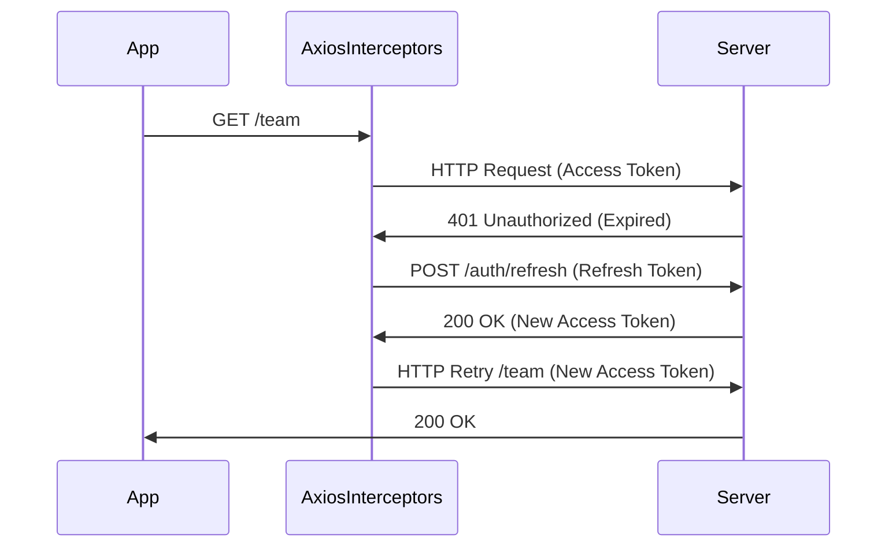

# API & OAuth2 Architecture Implementation Plan

The goal is to implement a robust, enterprise-grade API communication layer for the `Phdaot` project, focusing on a centralized configuration and a seamless OAuth2 authentication flow with automatic token refreshment.

## User Review Required

> [!IMPORTANT]
> - I will use **Axios** as the primary HTTP client due to its powerful interceptor support, which is essential for handling global authentication and retry logic.
> - Tokens will be managed through a centralized `TokenService` to keep the auth state synchronized across the application.
> - The architecture will follow a **Service-Oriented Design**, where each domain (Auth, Workspace, Team) has its own dedicated service file.

## Proposed Changes

### [Core] API & Auth Foundation

#### [NEW] [client.ts](file:///d:/SothyProject/NestJs/sansam_pdoud/Phdaot/src/api/client.ts)
- Create a global Axios instance with a `baseURL` from environment variables.
- **Request Interceptor**: Automatically attach the `Bearer [accessToken]` to all requests.
- **Response Interceptor**: Listen for `401 Unauthorized` errors. If found, trigger the token refresh flow and retry the original request.

#### [NEW] [token.service.ts](file:///d:/SothyProject/NestJs/sansam_pdoud/Phdaot/src/api/token.service.ts)
- centralized utility for getting/setting/clearing the Access and Refresh tokens (initially using `localStorage` for simplicity, with a note on moving to HttpOnly cookies for better security).

### [Services] Domain-Specific API Callers

#### [NEW] [auth.service.ts](file:///d:/SothyProject/NestJs/sansam_pdoud/Phdaot/src/api/services/auth.service.ts)
- Functions for `login`, `logout`, and `refreshToken`.

#### [NEW] [member.service.ts](file:///d:/SothyProject/NestJs/sansam_pdoud/Phdaot/src/api/services/member.service.ts)
- Refactor the member-related calls (Invite, Update, Delete) to use the centralized API client.

## OAuth2 Token Refresh Flow Diagram

## Open Questions

1. Do you prefer using **localStorage** or **HttpOnly cookies** for token storage? (Cookies are more secure, while localStorage is easier to implement for first prototypes).
2. Should I install **Axios** now, or do you have another preferred HTTP client?

## Verification Plan

### Automated Verification
- I will verify the code structure and type safety.
- Cross-check that the `401` interceptor correctly handles the promise retry logic.

### Manual Verification
- Once integrated, you can test by manually expiring an access token and verifying that the app automatically refreshes it without a page reload.
