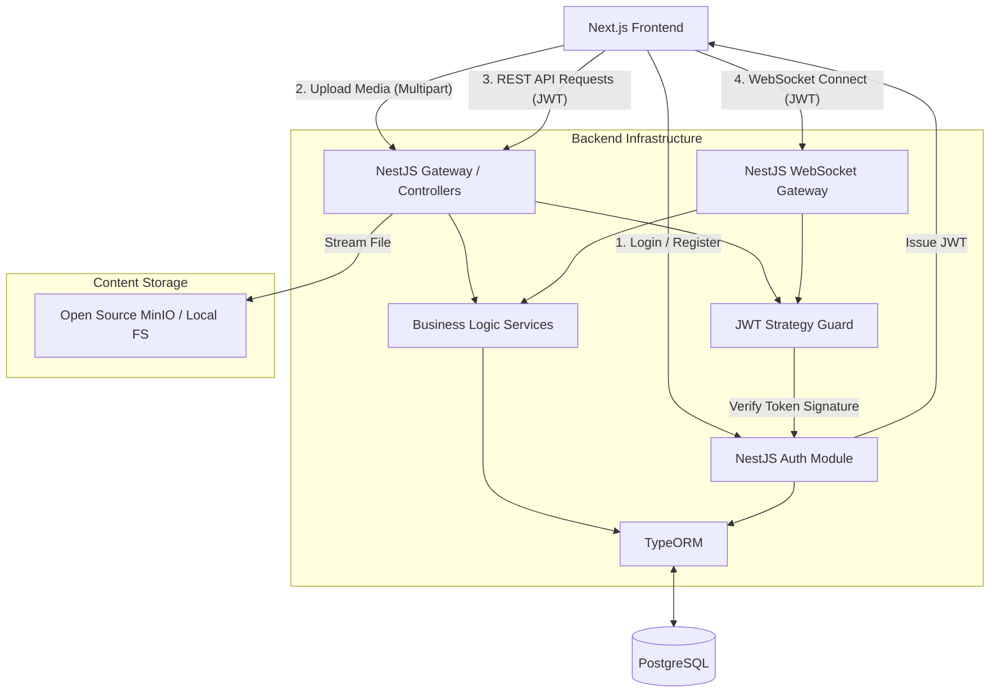

# Phdaot Backend Architecture Design

This document outlines the scalable, best-practice backend architecture for the Phdaot project utilizing **NestJS, PostgreSQL, and TypeORM**.

## 1. Technology Roles
- **NestJS**: The core modular server application and API Gateway. Handles routing, business logic, validation, and WebSockets.
- **PostgreSQL**: The primary relational database ensuring ACID compliance and strict data integrity for Users, Workspaces, Projects, Tasks, and Members.
- **TypeORM**: Handles relational mappings between the database and application, allowing type-safe queries and easy migrations.
- **Open-Source Authentication (NestJS + Passport)**: A 100% self-hosted, built-from-scratch Auth system. Manages user registration, secure Bcrypt password hashing, and stateless JWT token issuance directly from your own server.
- **Open-Source Storage (MinIO or Local Disk)**: Completely self-hosted solution for storing "Noted" image attachments to avoid third-party scaling costs.

---

## 2. Project Structure Architecture
To ensure scalability and easy maintenance, the application follows a **Domain-Driven Modular Design**. Each feature is encapsulated in its own module:

```text
src/
├── app.module.ts              # Root module importing all feature modules
├── main.ts                    # Application entry point
├── common/                    # Shared resources across the application
│   ├── decorators/            # Custom decorators (e.g., @CurrentUser(), @Roles())
│   ├── filters/               # Global exception filters
│   ├── guards/                # Authentication & Role guards (Local JWT Strategy)
│   └── interceptors/          # Logging and transform interceptors
├── config/                    # Environment variables validation & TypeORM configs
├── modules/                   # Domain-specific feature modules
│   ├── auth/                  # Handles Login/Register, JWT signing, Bcrypt hashing
│   ├── users/                 # Manage User Profiles and TypeORM User Entities
│   ├── workspaces/            # Manage Workspace creation and relations
│   ├── projects/              # Manage Projects within Workspaces
│   ├── tasks/                 # Task CRUD operations
│   │   ├── tasks.module.ts
│   │   ├── tasks.controller.ts
│   │   ├── tasks.service.ts
│   │   ├── tasks.gateway.ts   # WebSocket Gateway for real-time drag/drop
│   │   └── entities/          # TypeORM Task Entity
│   └── notes/                 # Manages the "Noted" rich-text & attachments features
└── shared/                    # Shared providers (e.g., EmailService for password resets)
```

---

## 3. High-Level Architecture Diagram
The architecture is designed to handle standard REST traffic alongside highly concurrent real-time WebSocket traffic, purely using your own self-hosted stack.



---

## 4. Real-Time Drag & Drop Architecture
Handling seamless drag-and-drop tasks requires sub-second latency and absolute data concurrency.

**The Flow:**
1. **Connection**: The client connects to the NestJS `@WebSocketGateway()` in the `TasksModule`, passing the self-signed JWT.
2. **Rooms**: Upon connecting, the user joins a "Room" identified by their current `projectId` (e.g., `client.join(projectId)`). This ensures they only receive websocket updates relevant to the board they are looking at.
3. **The Event (`task.moved`)**:
   - The user drags a task on the frontend. The frontend *optimistically updates* the UI instantly and emits a `task.moved` WebSocket event containing `{ taskId, newStatus, newOrderPosition }`.
4. **Execution & Broadcast**:
   - NestJS receives the event, validates the user's permission via Guards.
   - TypeORM updates the task status/order within a **Transaction** to prevent race conditions.
   - NestJS immediately broadcasts the updated task to everyone else in the `projectId` room via `server.to(projectId).emit('task.updated', task)`.

---

## 5. Storage Architecture for "Noted" (100% Free / Open Source)
To guarantee absolutely zero third-party storage fees, we replace Firebase Storage entirely. You have two excellent architectural choices for handling Attachments (Images, PDFs) attached to Notes:

**Option A: MinIO (Highly Scalable & Best Practice)**
MinIO is a lightning-fast, open-source object storage server.
- It acts exactly like an AWS S3 bucket but runs locally on your own server.
- If you ever decide to scale out to DigitalOcean Spaces, AWS S3, or Cloudflare R2, the NestJS code **does not need to change** because MinIO uses the exact same S3 API.
- **Flow**: Next.js sends a `multipart/form-data` request directly to a NestJS `@Post('upload')` controller. NestJS streams the buffer into MinIO and saves the resulting MinIO URL into PostgreSQL.

**Option B: NestJS Multer (Simplest & Lowest Budget for 1 Server)**
- If you are running on a single DigitalOcean Droplet or VPS, you don't even need MinIO.
- **Flow**: NestJS utilizes the built-in `MulterModule`. It catches the uploaded file and violently writes it directly to a local `/uploads` folder on the disk space you already pay for.
- NestJS then serves these files statically.

**Database Schema (`Note` Entity)**: Regardless of Option A or B, the DB methodology is identical:
   ```typescript
   @Entity('notes')
   export class Note {
     @PrimaryGeneratedColumn('uuid') id: string;
     @Column('text') content: string; 
     @Column('jsonb') attachments: { url: string; type: string; name: string }[];
     @ManyToOne(() => User) author: User;
     @ManyToOne(() => Workspace) workspace: Workspace;
   }
   ```
   *Using `jsonb` deeply stores arrays of local file URLs without generating massive multi-level relational tables.*

---

## 6. User Role Architecture (RBAC)
To manage granular access to Workspaces and Projects, we implement scalable Role-Based Access Control.

**The Flow:**
1. **Database Enums**: Roles are defined strictly via Postgres Enums (`OWNER`, `ADMIN`, `MEMBER`, `OBSERVER`).
2. **Workspace Members Entity**: Because a User can be an OWNER in Workspace A, but a simple MEMBER in Workspace B, roles are attached to the junction table, not the global user table.
   ```typescript
   @Entity('workspace_members')
   export class WorkspaceMember {
     @ManyToOne(() => User) user: User;
     @ManyToOne(() => Workspace) workspace: Workspace;
     @Column({ type: 'enum', enum: Role }) role: Role;
   }
   ```
3. **NestJS Guards**: We define a custom `@Roles()` decorator alongside a custom `RolesGuard`.
   - When hitting a restricted endpoint, e.g., `DELETE /tasks/:id`.
   - The Guard extracts the `userId` from the JWT Token payload, queries Postgres for their Specific `Role` context within that specific `projectId`, and either executes or blocks the request with a `403 Forbidden`.
